# 从 AI First 到 Harness 工程

## 开场（5 分钟）

大家好。今天我想和大家聊一个可能很多团队都遇到过的问题。

**请举手示意一下：你们团队已经在用 AI 编码工具了吗？Copilot、Cursor、Claude Code？**

好，看起来大部分团队都已经 AI First 了。那我再问一个问题：

**AI coding 让你们更轻松了，还是更累了？**

我看到不少苦笑。这其实是一个非常真实的矛盾——AI coding 让代码生成速度大幅提高了，但产品的交付时间并没有缩短。为什么？因为**人在代码 review 和测试环节成了瓶颈**。AI 写得越快，堆到你面前等着 review 的 PR 就越多，你反而更累了。

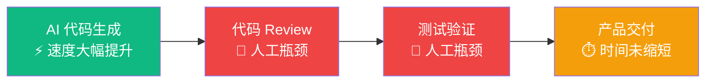

这张图就是现状——AI 加速了左边，但右边的人工环节成了新的瓶颈。整条链路的交付速度，取决于最慢的那个环节。

那怎么办？

今天我想告诉大家的核心判断是：

> **我们要从"写代码的人"变成"给 AI 提供好的工具、好的反馈的人"。**

换句话说，从使用模型，转变为**驾驭模型**。这就是从 AI First 到 Harness 工程的转变。

我会用一个公式来贯穿整场分享：

**Agent 效能 = 模型质量 × Harness 质量**

注意这里是乘法，不是加法。如果 Harness 接近 0，无论模型多强，系统整体效果仍然接近 0。

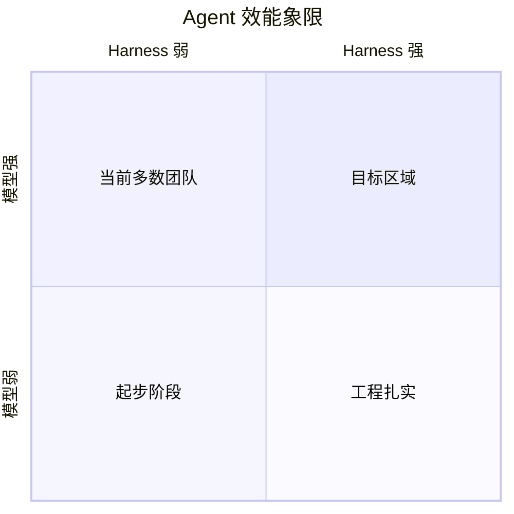

接下来的 45 分钟，我会从三个部分展开：
1. 为什么 AI First 不够
2. 什么是 Harness 工程
3. 如何落地

---

## 第一部分：AI First 为什么不够（10 分钟）

### 1. 模型有物理上限

首先我想说一句可能缓解大家焦虑的话：

> **大家其实不必过于焦虑，模型是有物理上限的。**

大模型基于 Transformer 架构，本质上是在预测下一个 TOKEN。这个架构决定了几个物理规律：

- **上下文窗口有限且昂贵**——每多一个 token，推理成本都在增加
- **KV cache 是核心优化点**——尽量不破坏前缀，复用缓存可降低成本、提升推理速度。比如 Claude Code 命中 prompt cache 时，成本直降 90%
- **注意力机制有上限**——模型在超长上下文中的"注意力"会衰减

理解了这些物理规律，你就明白为什么不能把所有东西都塞进 prompt，为什么上下文管理不是"越多越好"，而是需要**治理**。

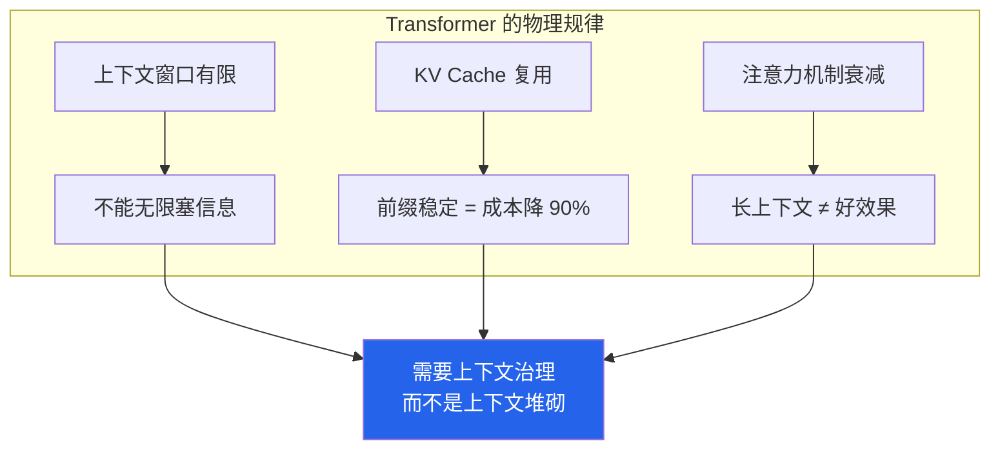

### 2. 三个常见失败模式

理解了物理规律之后，让我具体说说三种典型的失败模式。

**失败模式一：只换模型不换流程**

很多团队的做法是：升级到最新模型，但工作方式完全没变。还是把所有期望塞进一条 prompt，还是让 AI 直接输出代码然后人工 review，还是没有验证链、没有恢复路径。

这就像你给一辆老爷车换了一个 F1 引擎，但刹车系统、悬挂系统、轮胎都没升级。跑得更快，但也更容易失控。

**失败模式二：Prompt 即全部**

第二种失败模式是把所有工程问题都试图用 Prompt 解决。"你要遵守这些规则"、"你要调用这些工具"、"你要记住这些上下文"、"你出错了要这样恢复"——全部写进 Prompt。

结果呢？Prompt 越来越长，KV cache 越来越难命中，成本越来越高，模型越来越困惑。

这就是违背了 Transformer 的物理规律——**Prompt 不是工程系统**。工具调用、状态管理、错误恢复、权限控制，这些应该是工程基础设施，不应该依赖模型的"记忆力"。

**失败模式三：无验证就交付**

AI 写完代码，看起来没问题，直接合并。没有 lint、没有测试、没有类型检查。

这里我引用周晓在 Harness 分享里的一句话：

> **AI 写完代码之后，它没有帮你把剩下的工作搞定——这不就是大家的机会吗？**

对，验证、测试、review、交付——这些"剩下的工作"，恰恰就是 Harness 工程要解决的问题，也是工程师在 AI 时代最大的价值所在。

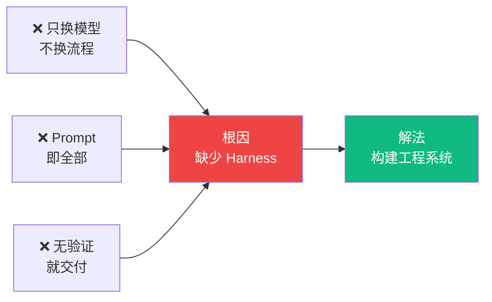

### 3. 竞争焦点已经转移

最后一个宏观判断：**AI 产品的竞争焦点，正在从"模型能不能写"转向"谁来编排和调度"。**

模型经常是可替换的。同一条任务链，今天接 GPT-4，明天可以换 Claude，后天换 Gemini。但任务契约、工具协议、状态机、验证命令、恢复机制、评估链路——这些才是可持续积累的工程资产。

**如果你不是模型，你就是 Harness。**

---

## 第二部分：什么是 Harness 工程（15 分钟）

### 核心定义

**Harness = 模型之外、让 Agent 可靠工作的一切工程机制。**

它不是"模型外面的一层壳"，而是 Agent 的操作系统。Model 是大脑，负责思考；Harness 就是身体、工具、环境和规则，负责执行、记忆、恢复和控制。

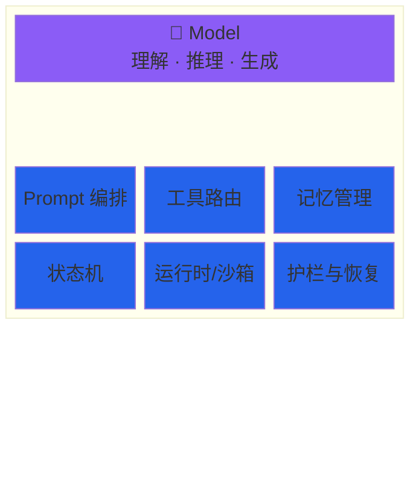

### 1. Harness 能力栈：六层架构

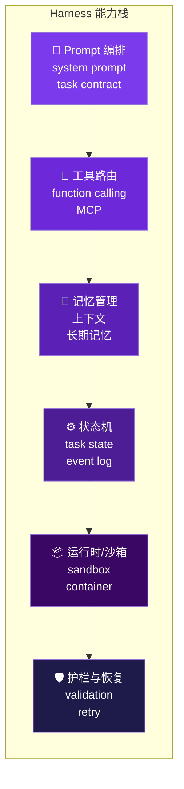

让我逐层展开。

**第一层：Prompt 编排** — 模型当前该按什么角色、目标和约束工作？不是把所有东西塞进一条 prompt，而是分层管理：rules file（长期硬约束）、task contract（当前任务边界）、working memory（会话状态）。

**第二层：工具路由** — 这里有一个重要标准：好的工具应该**对 AI 友好**。周晓在分享中提到了三个标准：
1. **贴近物理现实** — 比如 LSP（Language Server Protocol）能让模型感知人看到的代码问题并动态修改
2. **更结构化的输出** — 在上下文窗口有限时，通过更少的、更结构化的信息给模型
3. **重视错误反馈** — 好的错误信息是模型自我修正的关键输入

**第三层：记忆管理** — 上下文管理的关键不是"越多越好"。有些产品（如 Manus）在探索将上下文压缩到文件来解决问题。核心思路是：减少重复计算、治理上下文，而不是堆砌上下文。

**第四层：状态机** — 当前任务在哪一步？下一步走哪条边？是继续执行、等待输入，还是人工接管？

**第五层：运行时/沙箱** — 代码在哪执行？权限边界在哪？

**第六层：护栏与恢复** — 出错、越界、注入或结果异常时怎么办？

**关键不是"多加几个工具"，而是把六层连成一套可靠的执行回路。**

### 2. AI 友好的工程实践：不只是工具，还有架构和选型

工具路由这一层值得深入展开。但"AI 友好"不只是工具的事，**技术选型和架构设计也需要 AI 友好**。

#### 好工具的三个标准

周晓在分享中提到了三个标准，这些标准同样适用于技术选型和架构：

1. **贴近物理现实** — 比如 LSP（Language Server Protocol）能让模型感知人看到的代码问题并动态修改
2. **更结构化的输出** — 在上下文窗口有限时，通过更少的、更结构化的信息给模型
3. **重视错误反馈** — 好的错误信息是模型自我修正的关键输入

#### AI 友好的技术选型

选择技术栈时，要考虑 AI 的"学习成本"：

- **优先选择主流技术** — React、Next.js、TypeScript、Python、Go 等，模型训练数据充足，理解更准确
- **优先选择文档完善的框架** — 文档质量直接影响模型的理解能力
- **避免过于小众的技术** — 模型训练数据少，容易产生幻觉或错误建议
- **考虑 API 的语义清晰度** — 命名清晰、参数明确的 API 更容易被模型正确调用

#### AI 友好的技术架构

架构设计也要为 AI 优化：

- **模块化、清晰的代码结构** — 让模型能快速定位相关代码
- **明确的接口定义** — TypeScript 类型、OpenAPI 规范等，给模型提供结构化信息
- **良好的命名规范** — 函数名、变量名要语义清晰，减少模型理解成本
- **可测试的架构** — 让 AI 能自动运行测试验证修改

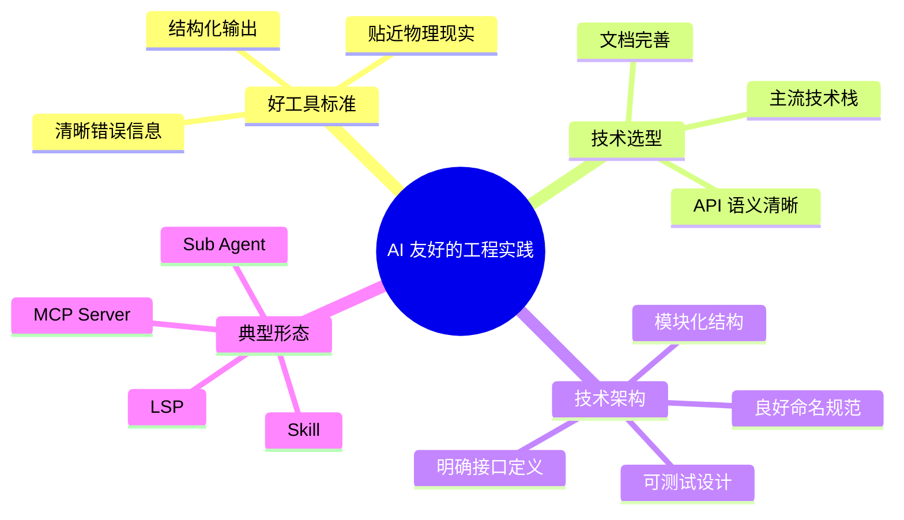

这里有一个重要的洞察：当模型上下文窗口有限且昂贵时，**多智能体（Multi Agent）可以突破单 agent 注意力机制的上限**。每个 sub agent 有自己的上下文窗口，专注于自己的任务，最后收口汇总——这比把所有东西塞进一个超长上下文要更高效、更可靠。

**关键点**：AI 友好不是"迁就 AI"，而是让整个工程体系更结构化、更清晰、更可维护——这本身就是好的工程实践。

### 3. Workflow vs Agent

**并不是所有系统都应该做成高自治 Agent。**

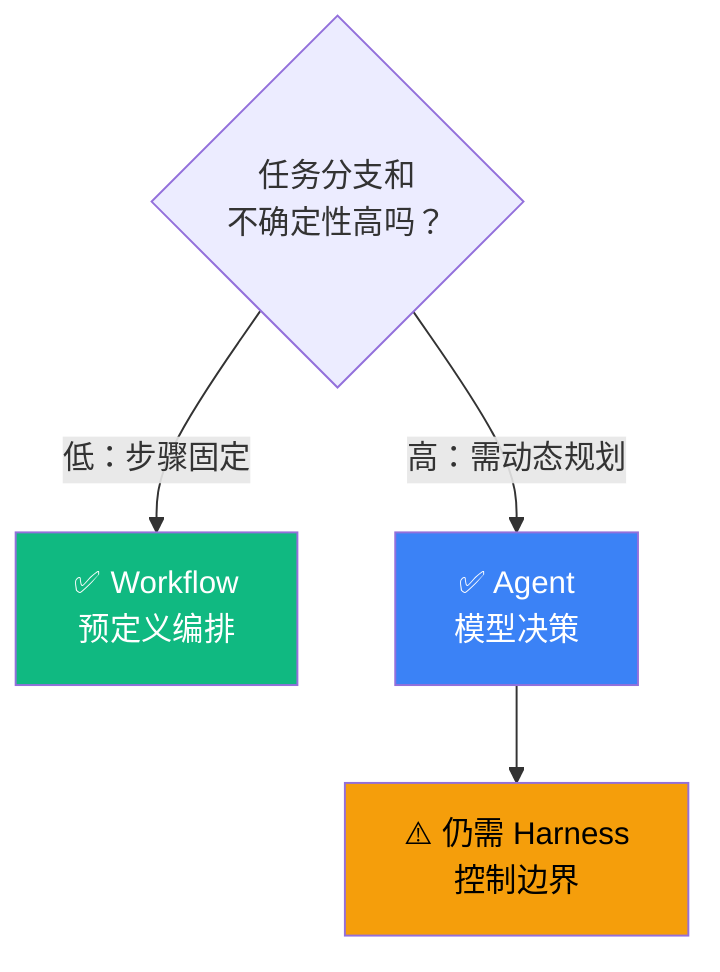

判断顺序：
1. 先问能不能用固定 workflow 解决
2. 只有当任务分支多、信息不完整时，再引入 agent
3. 即使引入 agent，也要保留 harness 的控制

> **Harness 的第一职责不是"放大自由度"，而是"在必要自由度之外收紧不确定性"。**

### 4. 工程重心转移

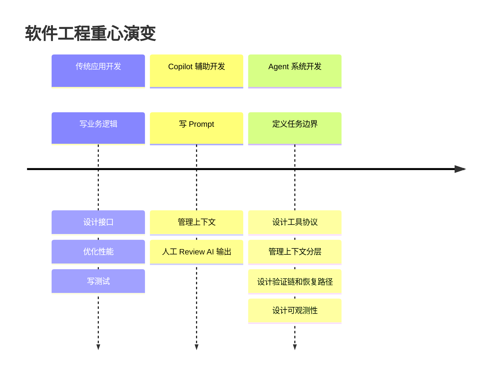

这不是说"软件工程不重要了"。恰恰相反，软件工程从功能编码进一步上移到了**执行回路设计**。

研发工程师的角色定义正在转变：

> **从写代码的人，变成给 agent 设计环境、反馈的人。**
> **从使用模型，变为驾驭模型。**
> **关键不再是你能写什么代码，而是你能给 agent 提供什么。**

---

## 第三部分：如何落地（15 分钟）

### AI Dev Loop：让 AI 端到端工作

在讲具体清单之前，先看一张更大的图。我们要构建的不是"AI 辅助"，而是一个完整的 **AI Dev Loop**——让 AI 完成代码编写、验收及交付，人类仅需 review 交付产物和稳定性。

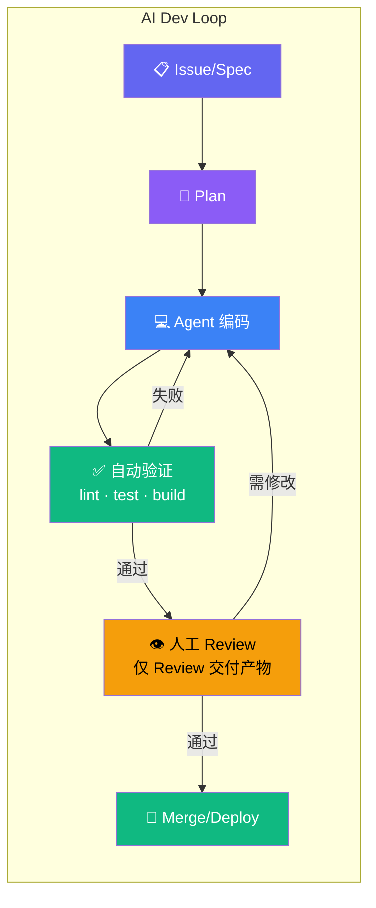

注意这里的关键设计：**人只出现在 Review 环节**，而不是每一步都需要人介入。AI 负责编码和自动验证的闭环，人负责最终交付质量的把关。

要让这个循环转起来，你需要以下六步。

### 六步实施清单

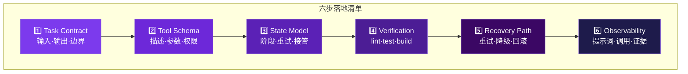

**第一步：Task Contract（任务契约）**

每个任务必须有明确的输入、输出、可编辑范围、完成条件和交付证据。

**具体实施方案**：

1. **使用 GitHub Issues / Linear / Jira 模板**
   - 创建标准化的 Issue 模板，强制填写输入、输出、范围
   - 示例：`.github/ISSUE_TEMPLATE/bugfix.yml`

2. **Task Contract 文件**
   - 在项目根目录创建 `contracts/` 目录
   - 每个任务类型一个 YAML 文件：`bugfix.contract.yaml`、`feature.contract.yaml`
   - 示例结构：
   ```yaml
   task_type: bugfix
   input:
     - issue_url: required
     - reproduction_steps: required
   output:
     - fixed_code: required
     - test_evidence: required
   editable_scope:
     - allowed_paths: ["src/components/*", "src/utils/*"]
     - forbidden_paths: ["src/core/*", "config/*"]
   completion_criteria:
     - reproduction_no_longer_triggers: true
     - regression_tests_pass: true
   evidence:
     - test_output_screenshot: required
     - git_diff: required
   ```

3. **当前流行工具**：
   - **Anthropic Claude Code** - 内置 Task Contract 支持，通过 CLAUDE.md 定义规则
   - **GitHub Copilot Workspace** - 支持 Issue → Plan → Code 的契约化流程
   - **Cursor** - 通过 `.cursorrules` 文件定义任务边界

举个 Bugfix 任务的契约：
- 输入：Issue 链接 + 复现步骤
- 输出：修复后的代码 + 测试通过证明
- 可编辑范围：只能改相关模块，不能动其他文件
- 完成条件：复现步骤不再触发错误 + 回归测试通过
- 证据：测试输出截图 + git diff

**第二步：Tool Schema（工具协议）**

工具不是"随便调"的，要对 AI 友好：
- 清晰的工具描述和参数约束
- 明确的权限范围
- 结构化的返回格式
- **好的错误信息**——这点很多人忽略，但对模型自我修正至关重要

**具体实施方案**：

1. **MCP (Model Context Protocol)** - 2024 年 Anthropic 推出的标准化工具协议
   - 统一的工具定义格式
   - 跨工具共享上下文
   - 示例：`mcp.json` 配置文件
   ```json
   {
     "mcpServers": {
       "filesystem": {
         "command": "npx",
         "args": ["-y", "@modelcontextprotocol/server-filesystem", "/workspace"]
       }
     }
   }
   ```

2. **OpenAPI / Swagger** - API 工具的标准定义
   - 自动生成工具描述
   - 参数类型和约束清晰
   - 错误码标准化

3. **当前流行的工具生态**：
   - **LangChain Tools** - Python 生态的工具标准
   - **Vercel AI SDK Tools** - TypeScript 生态的工具定义
   - **Anthropic Tool Use** - Claude 原生的 function calling
   - **OpenAI Function Calling** - GPT 系列的工具调用

4. **权限控制实践**：
   - 使用沙箱环境（Docker、E2B、Modal）
   - 文件系统权限：只读 vs 读写，路径白名单
   - API 权限：rate limiting、scope 限制

**第三步：State Model（状态机）**

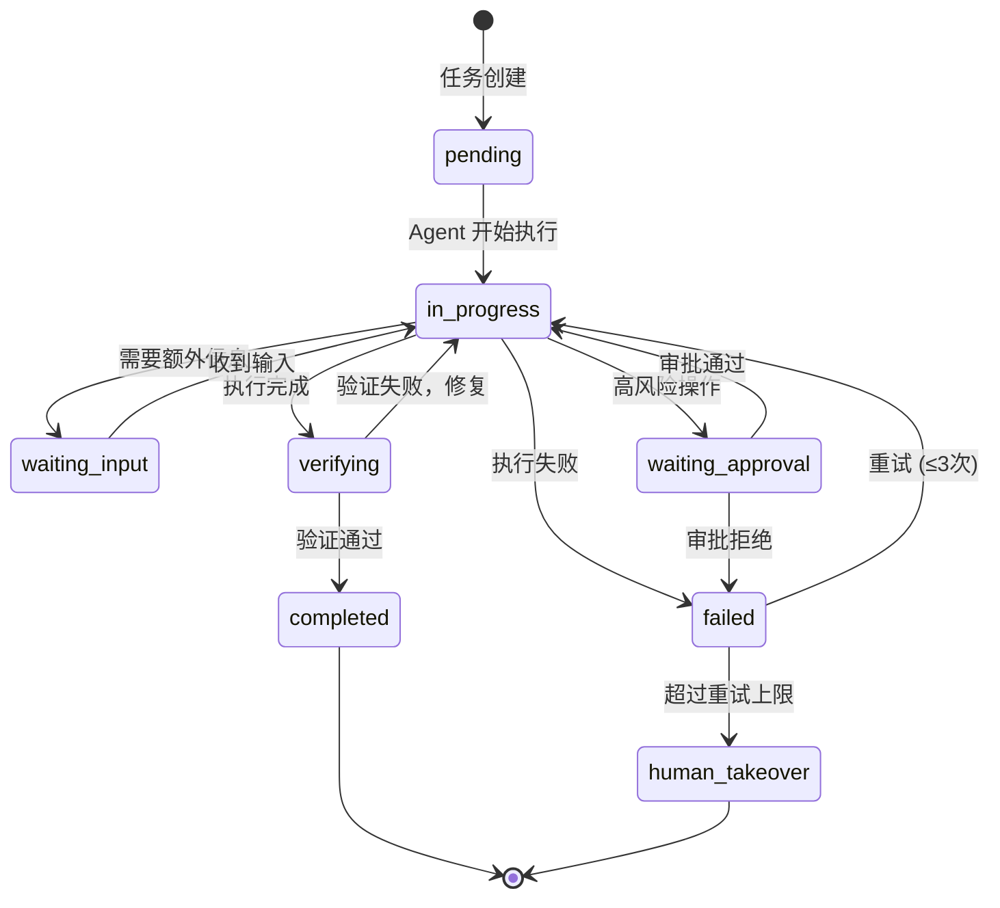

这张状态机图是 Harness 工程的核心。每个 agent 任务都应该有显式的状态转换，而不是一个黑箱。

**第四步：Verification（验证链）**

最小验证栈：lint → test → build/type check → 高风险目录审批 → PR 证据字段

构建 AI Native 的验证链时要注意：减少上下文消耗，提供好的错误反馈。比如 lint 报错时，不要给模型整个 lint 输出，而是只给相关的错误行和修复建议。

**具体实施方案**：

1. **Pre-commit Hooks** - 本地验证第一道防线
   - 工具：`husky` + `lint-staged`
   - 配置示例：
   ```json
   {
     "lint-staged": {
       "*.{js,ts,tsx}": ["eslint --fix", "prettier --write"],
       "*.{json,md}": ["prettier --write"]
     }
   }
   ```

2. **CI/CD 验证流水线** - 云端验证
   - **GitHub Actions** - 最流行的 CI/CD 平台
   - **GitLab CI** - 企业级选择
   - **Vercel / Netlify** - 前端项目的自动化部署和验证

   示例 GitHub Actions workflow：
   ```yaml
   name: Verify
   on: [pull_request]
   jobs:
     verify:
       runs-on: ubuntu-latest
       steps:
         - uses: actions/checkout@v4
         - run: npm ci
         - run: npm run lint
         - run: npm run test
         - run: npm run build
   ```

3. **当前流行的验证工具**：
   - **ESLint / Biome** - JavaScript/TypeScript 代码检查
   - **Prettier** - 代码格式化
   - **TypeScript** - 类型检查
   - **Vitest / Jest** - 单元测试
   - **Playwright / Cypress** - E2E 测试
   - **SonarQube / CodeClimate** - 代码质量分析

4. **AI 友好的错误输出**：
   - 使用 `--format=json` 输出结构化错误
   - 只返回相关文件的错误，不要全量输出
   - 包含修复建议（如 ESLint 的 `--fix` 提示）

**第五步：Recovery Path（恢复路径）**

Agent 会失败，这是常态。关键是失败后能否自动恢复，还是需要人工介入。

**具体实施方案**：

1. **重试策略** - 自动重试机制
   - **指数退避（Exponential Backoff）**：第一次等 1s，第二次等 2s，第三次等 4s
   - **最大重试次数**：通常设置为 3 次
   - 工具：`retry` npm 包、`tenacity` Python 库

2. **降级策略** - 当 Agent 失败时的备选方案
   - Agent 失败 → 切换到 Workflow 模式
   - 复杂任务失败 → 拆分为更小的子任务
   - 自动化失败 → 转人工处理

3. **回滚机制** - 撤销错误操作
   - **Git Worktree** - 隔离的工作环境，失败后直接删除
   - **Docker Container** - 容器化环境，失败后销毁容器
   - **Database Transaction** - 数据库事务，失败后自动回滚

4. **当前流行的沙箱和隔离工具**：
   - **E2B (e2b.dev)** - 云端代码执行沙箱，支持 Python、Node.js
   - **Modal** - 云端函数执行平台
   - **Firecracker** - AWS 的轻量级虚拟化技术
   - **Docker** - 容器化隔离
   - **Git Worktree** - Git 原生的工作目录隔离

5. **人工接管点设计**：
   - 高风险操作前强制审批（删除文件、修改配置）
   - 连续失败 3 次后暂停，等待人工介入
   - 超出预算限制时（API 调用次数、token 消耗）

**实践示例**：
- 工具调用失败 → 重试一次，仍失败 → 切换备用工具或人工接管
- 测试失败 → 分析失败原因 → 修复 → 重新测试，超过 3 次 → 人工接管
- 越权操作 → 立即阻止 → 记录日志 → 通知人工

**第六步：Observability（可观测性）**

能否追踪提示词、工具调用、中间结果和最终证据？如果不能，你的 agent 就是一个黑箱。

**具体实施方案**：

1. **日志和追踪系统**
   - **LangSmith** - LangChain 官方的可观测平台，支持 trace、评估、监控
   - **Helicone** - LLM 请求的代理和监控平台
   - **Weights & Biases (W&B)** - 机器学习实验追踪
   - **Datadog / New Relic** - 传统 APM 工具，支持自定义 trace

2. **Prompt 版本管理**
   - **Prompt 文件化**：将 system prompt 存储为文件（如 `CLAUDE.md`），纳入 Git 版本控制
   - **Prompt 模板引擎**：使用 Jinja2、Handlebars 等模板引擎管理动态 prompt
   - **A/B 测试**：使用 LangSmith 或自建系统进行 prompt 效果对比

3. **结构化日志格式**
   ```json
   {
     "timestamp": "2026-03-23T10:30:00Z",
     "task_id": "bugfix-123",
     "agent_id": "agent-001",
     "event": "tool_call",
     "tool_name": "run_tests",
     "input": {"test_path": "src/checkout.test.ts"},
     "output": {"status": "failed", "error": "..."},
     "token_usage": {"input": 1200, "output": 450}
   }
   ```

4. **当前流行的 Agent 框架（内置可观测性）**：
   - **LangGraph** - LangChain 的状态机框架，支持可视化 trace
   - **AutoGen** - Microsoft 的多智能体框架
   - **CrewAI** - 角色化的多智能体框架
   - **Anthropic Claude Code** - 内置完整的工具调用日志和上下文管理

5. **关键指标监控**：
   - **成功率**：任务完成率、测试通过率
   - **成本**：Token 消耗、API 调用次数
   - **延迟**：端到端执行时间、各步骤耗时
   - **人工介入率**：需要人工接管的任务比例

### 上下文分层策略

上下文管理的原则是**治理而非堆砌**。利用 KV cache 的物理规律——保持前缀稳定、复用缓存。

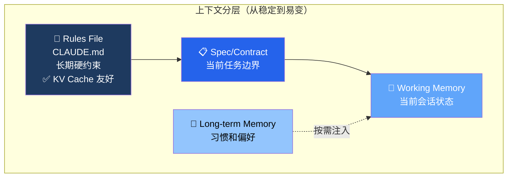

### 教学案例：从"辅助编码"到"AI Dev Loop"

让我用一个真实场景把这些概念串起来。

假设你的团队要修复一个线上 bug：用户在结账页面点击支付后，偶尔出现白屏。

**传统 AI 辅助方式**（AI First）：
1. 你把 bug 描述丢给 AI
2. AI 给你一段修复代码
3. 你手动 review、手动测试、手动提 PR
4. 人依然是每一步的瓶颈

**Harness 工程方式**（AI Dev Loop）：

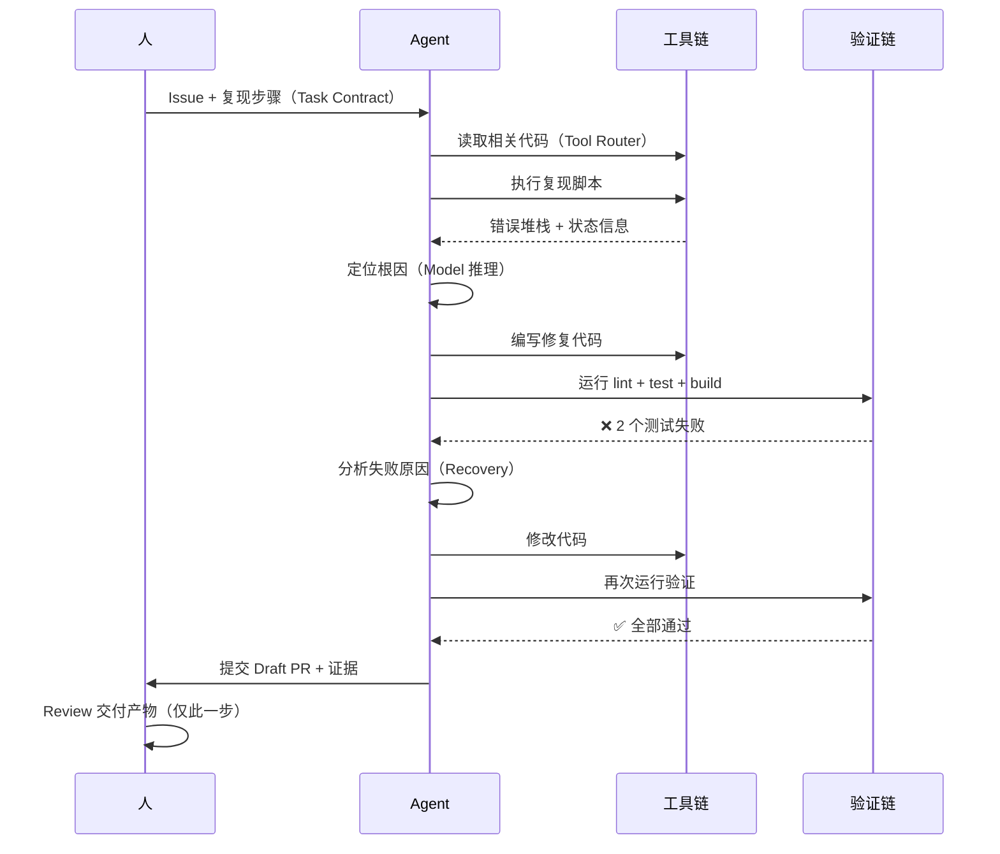

在这个流程中，人只出现在最后的 Review 环节。Agent 自己完成了编码、验证、失败恢复的完整闭环。这就是 Harness 工程的价值——**释放人类的注意力，让人只做最高价值的判断。**

---

## 第四部分：常见误区与团队采纳（5 分钟）

### 四个误区

**误区一：把 Agent 理解成"会调用工具的聊天框"**

工具接入只是第一步。没有状态管理、验证和恢复，工具越多，失败面反而越大。

**误区二：把 Memory 当作唯一真相源**

长期记忆适合存偏好和稳定习惯，不适合替代显式规则文件、任务合同和验证命令。**旧记忆比没有记忆更危险。**

**误区三：以为模型升级等于系统升级**

模型升级会改善理解和生成，但不会自动补齐权限、重试、回滚、评估和审计能力。系统短板仍然暴露在 harness 层。

**误区四：上下文越多越好**

这违背了 Transformer 的物理规律。上下文管理要**治理**——该压缩的压缩，该丢弃的丢弃，该分层的分层。

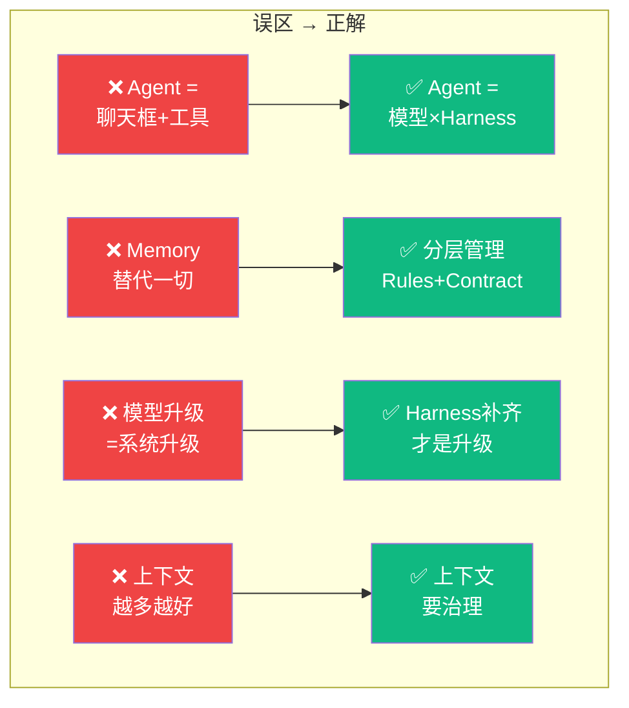

### 团队采纳路径

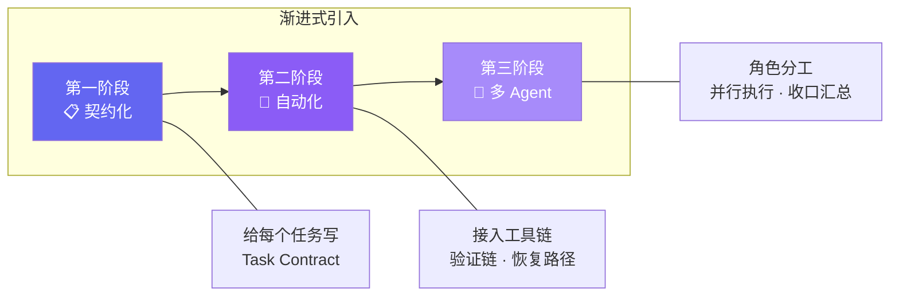

不同角色的切入点：
- **产品**：从 Spec-First 工作流开始
- **前端/后端**：从 Bugfix 工作流开始
- **QA**：从 Test 工作流开始
- **DevOps**：从 CI/CD 集成开始

---

## 收尾（5 分钟）

### 三句话总结

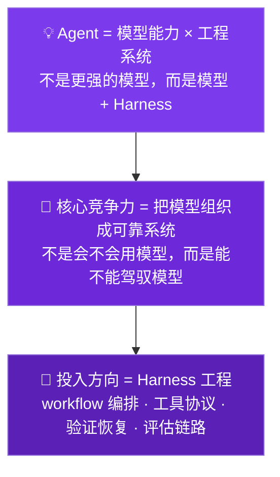

### 行动号召

最后给大家一个具体的行动建议：

**回去给你的下一个任务写一份 Task Contract。**

就五个问题：
1. 输入是什么？
2. 输出是什么？
3. 可编辑范围是什么？
4. 怎么验证完成？
5. 要交付什么证据？

这就是 Harness 工程的第一步。

记住：

> **我们要从写代码的人变成给 AI 提供好的工具、好的反馈的人。模型有物理上限，了解了边界之后不必过于焦虑——你的机会恰恰在 AI 没有搞定的那部分。**

### Q&A

好，我的分享到这里。接下来是 Q&A 时间，欢迎大家提问。

谢谢大家。
